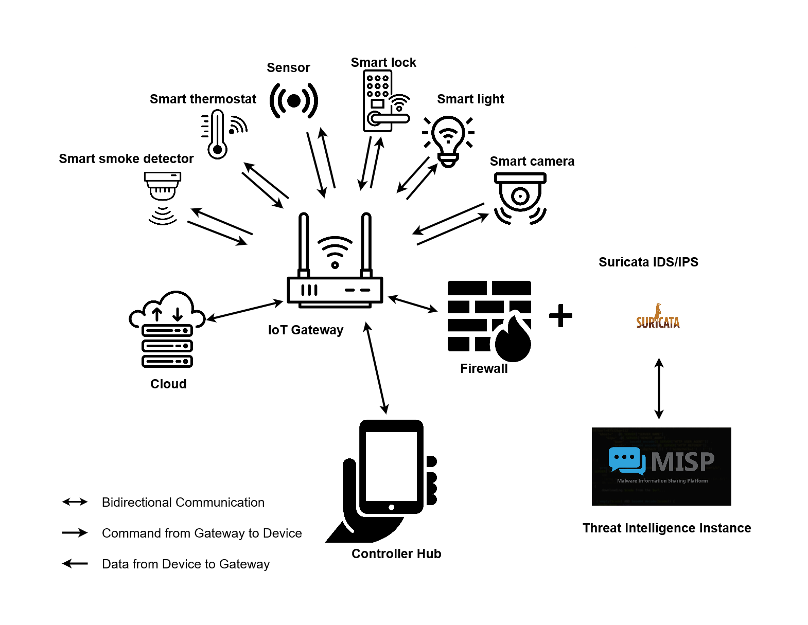

# Threat Intelligence-Driven Cybersecurity for IoT Ecosystems

This project presents an approach to improving the cybersecurity of smart home devices through the integration of threat intelligence, using the Raspberry Pi as a prototype smart home device. This implementation combines an Intrusion Detection and Prevention System (IDS/IPS) with real-time threat intelligence. To increase the ability to detect and respond to threats.


## Table of Contents
- [Prerequisite](#prerequisite)
- [Installation](#installation)
- [Usage](#usage)
- [Features](#features)
- [Visuals](#visuals)
- [How It Works](#how-it-works)
- [Limitations](#limitations)
- [Contributing](#contributing)
- [License](#license)
- [Acknowledgments](#acknowledgments)
- [Contact Information](#contact-information)


## Prerequisite
To be able to use this you will need to have the following setup 
- A running MISP Instance setup [https://www.misp-project.org/download/](https://www.misp-project.org/download/) 
- MISP API Key (From the MISP instance that has been setup)
- Cohere API Key ([https://dashboard.cohere.com/api-keys](https://dashboard.cohere.com/api-keys))
- Mail Trap Token ([https://mailtrap.io/](https://mailtrap.io/))


## Installation
To set up the project, follow these steps:

1. Clone the repository:
   ```bash
   git clone https://github.com/SamAddy/smart-home-cybersecurity.git
   ```
2. Navigate to the project directory:
   ```bash
   cd smart-home-cybersecurity
   ```
3. Create a virtual environment:
   ```bash
   python -m venv venv
   ```
4. Activate the virtual environment:
   - On Windows:
     ```bash
     venv\Scripts\activate
     ```
   - On macOS/Linux:
     ```bash
     source venv/bin/activate
     ```
5. Install the required dependencies:
   ```bash
   pip install -r requirements.txt
   ```
6. Create a `.env` file in the project directory and add the following environment variables:
   ```properties
   MISP_API_KEY = "your_misp_api_key"
   COHERE_API_KEY = "your_cohere_api_key"
   MAILTRAP_TOKEN = "your_mailtrap_token"
   ```

## Usage
To execute the main script, run the following command:
```bash
python iot_threat_detection.py
```

## Features
- **Integration with MISP**: Automates the communication process between the smart home device and the MISP instance.
- **Threat Intelligence Gathering**: Fetches Indicators of Compromise (IoCs) from MISP and updates IDS/IPS rules.
- **Alert Management**: Creates MISP events based on high-priority alerts from the smart home device.
- **Mitigation Information**: Generates mitigation steps using Cohere's API and sends them via email.

## Visuals

*Figure 1: Overview of Proposed Security Architecture for Smart Home*


## How It Works
When the script is run, it performs the following steps:

1. **Connect to MISP**: The script connects to the MISP instance using the provided API key.
2. **Fetch IoCs**: It fetches Indicators of Compromise (IoCs) that have been shared from sources.
3. **Update Suricata Ruleset**: The fetched IoCs are used to update the ruleset in Suricata (IDS/IPS). This allows the IDS/IPS to block threats based on the latest intelligence.
4. **Process High-Severity Alerts**: When a high-severity alert is received, it is sent to MISP to create an event.
5. **Generate Mitigation Information**: The script uses Cohere's API to generate human-readable mitigation steps for the detected threats.
6. **Send Email Notifications**: The generated mitigation information is sent via email using Mailtrap.


## Limitations
- The script does not filter out IoCs that are already present in the ruleset, which can lead to redundancy.
- If no IoCs are present, it can be challenging for the IDS/IPS to block threats effectively.
- As the number of IoCs grows, the performance of the IDS/IPS may be impacted.
- The updated ruleset may lead to an increase in false positives, requiring manual review and adjustment.


## Contributing
We welcome contributions from the community! If you have suggestions for improvements or would like to report issues, please feel free to submit pull requests or open issues.

## License
This project is licensed under the MIT License, allowing for both personal and commercial use.

## Acknowledgments
Special thanks to the developers of the libraries and tools used in this project, including PyMISP, Cohere, and Mailtrap.

## Contact Information
For inquiries or support, please reach out to SamAddy via [LinkedIn](https://www.linkedin.com/in/samuel-k-addison/).
